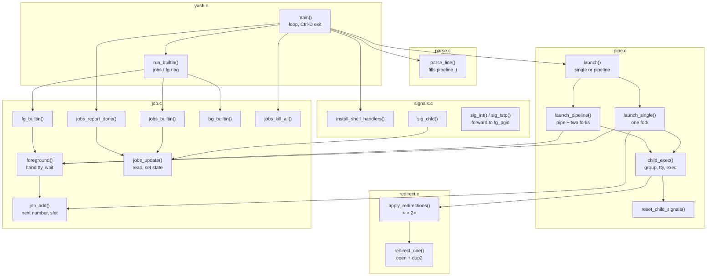
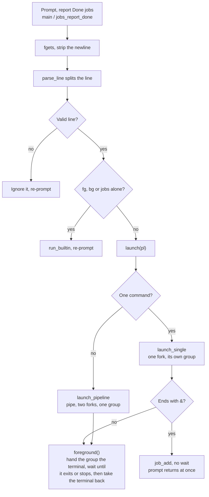
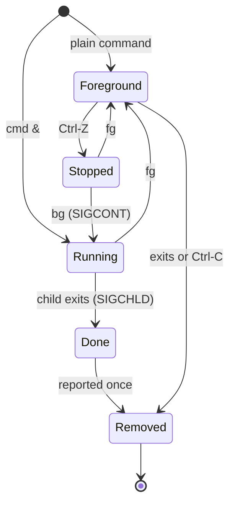

# yash Shell: Project 1 Cheat Sheet

Oct 7, 2026

This is a map of my yash implementation: where each function lives, what calls it, and which spec feature it serves, so you can line it up against your own version.

## At a glance

Each box is a file and each arrow is a function call. `yash.h` (shared structs, limits and prototypes) is included by every file and is not drawn. Private helpers in `job.c` (`job_find`, `job_by_num`, `job_current`, `job_print`, `print_jobs`) are listed in the Function index.

## Build

`make` compiles each `.c` to a `.o` with `gcc -Wall -Wextra -g -std=gnu99`, then links the six objects into `yash`.

| Target or line | What it does |
| --- | --- |
| `OBJS = yash.o parse.o redirect.o pipe.o signals.o job.o` | The six objects; a new source file must be added here |
| `yash: $(OBJS)` | Links the objects into `./yash`; the `.o` files come from make's built-in `.c` to `.o` rule, using `CFLAGS` |
| `$(OBJS): yash.h` | Any change to `yash.h` rebuilds every object |
| `make clean` | Removes `yash` and all `.o` files (`.PHONY`) |

To submit, run `tar czvf yash.tgz yash` from the parent folder so the archive holds a `yash/` folder with the Makefile inside.

## Function index

Every function in my version, grouped by file in call order; `static` ones are private to their file.

| Function | File | What it does | Called by | Calls |
| --- | --- | --- | --- | --- |
| `main` | `yash.c` | Prompt, read, parse, dispatch loop; Ctrl-D exits | (entry point) | `jobs_init`, `install_shell_handlers`, `jobs_report_done`, `parse_line`, `run_builtin`, `launch`, `jobs_kill_all` |
| `run_builtin` (static) | `yash.c` | Runs `jobs` / `fg` / `bg` in the shell when alone on the line | `main` | `jobs_builtin`, `fg_builtin`, `bg_builtin` |
| `parse_line` | `parse.c` | Tokenizes with `strtok_r`, fills `pipeline_t`, rejects bad syntax, strips `&` from `raw` | `main` | (libc only) |
| `launch` | `pipe.c` | Flushes stdout, picks single or pipeline | `main` | `launch_single`, `launch_pipeline` |
| `launch_single` (static) | `pipe.c` | One fork; background goes to the table, foreground is waited on | `launch` | `child_exec`, `job_add`, `foreground` |
| `launch_pipeline` (static) | `pipe.c` | `pipe()`, two forks, `dup2` each end, right child joins left's group | `launch` | `child_exec`, `foreground` |
| `child_exec` (static) | `pipe.c` | In the child: `setpgid`, take the terminal if foreground, reset signals, redirect, `execvp` | `launch_single`, `launch_pipeline` | `reset_child_signals`, `apply_redirections` |
| `reset_child_signals` (static) | `pipe.c` | Restores default SIGINT, SIGTSTP, SIGCHLD, SIGTTOU | `child_exec` | (libc only) |
| `apply_redirections` | `redirect.c` | Applies `<`, `>`, `2>` from the `cmd_t` | `child_exec` | `redirect_one` |
| `redirect_one` (static) | `redirect.c` | `open` + `dup2` onto fd 0, 1 or 2 | `apply_redirections` | (libc only) |
| `install_shell_handlers` | `signals.c` | Installs the three handlers, ignores SIGTTOU | `main` | (libc only) |
| `sig_int`, `sig_tstp` (static) | `signals.c` | Forward Ctrl-C / Ctrl-Z to `-fg_pgid` | kernel | `kill` |
| `sig_chld` (static) | `signals.c` | Saves errno, reaps background jobs | kernel | `jobs_update` |
| `jobs_init` | `job.c` | Zeroes the job table | `main` | (none) |
| `job_find`, `job_by_num`, `job_current` (static) | `job.c` | Look up a job by pgid, by number, or the highest number | `job_add`, `foreground`, `print_jobs`, `job_print`, `fg_builtin`, `bg_builtin` | (none) |
| `job_add` | `job.c` | Takes a free slot, number = highest + 1 | `launch_single`, `foreground` | `job_current` |
| `job_print`, `print_jobs` (static) | `job.c` | Print one line / the table in number order, then free Done slots | `jobs_builtin`, `jobs_report_done` | `job_by_num`, `job_current` |
| `jobs_update` | `job.c` | `waitpid(-pgid, WNOHANG \| WUNTRACED \| WCONTINUED)` on each background job | `sig_chld`, `jobs_builtin`, `jobs_report_done` | (libc only) |
| `foreground` | `job.c` | Hands over the terminal, optional SIGCONT, waits on the group, takes the terminal back, records a stop | `launch_single`, `launch_pipeline`, `fg_builtin` | `job_find`, `job_add` |
| `jobs_builtin` | `job.c` | `jobs` command | `run_builtin` | `jobs_update`, `print_jobs` |
| `jobs_report_done` | `job.c` | Prints Done jobs before each prompt | `main` | `jobs_update`, `print_jobs` |
| `fg_builtin` | `job.c` | Prints the current job's command, resumes it in the foreground | `run_builtin` | `job_current`, `foreground` |
| `bg_builtin` | `job.c` | SIGCONT to the newest stopped job, prints `[n]+ cmd &` | `run_builtin` | `job_current` |
| `jobs_kill_all` | `job.c` | SIGKILL to every live job group | `main` | (libc only) |

## Feature traces

Each spec feature as the chain of functions that implements it; follow a row left to right to read the code in order.

| Feature | Call chain | Where the key work happens |
| --- | --- | --- |
| Plain command (`ls -l`) | `main` → `parse_line` → `run_builtin` (no) → `launch` → `launch_single` → fork → `child_exec` → `execvp`; parent → `foreground` | `child_exec` sets the group and terminal before exec |
| Redirection (`<`, `>`, `2>`) | `parse_line` sets `cmd_t.in/out/err` → `child_exec` → `apply_redirections` → `redirect_one` | `redirect.c`; runs after the pipe `dup2`, so a file beats the pipe |
| Pipe (`a \| b`) | `parse_line` (`ncmds = 2`) → `launch` → `launch_pipeline` → left fork (`dup2` to stdout) and right fork (`dup2` from stdin) → `child_exec` each → `foreground(left)` | Right child calls `setpgid(0, left)`, so one `waitpid(-pgid)` loop waits for both |
| Background (`cmd &`) | `parse_line` (`bg = 1`, `&` cut from `raw`) → `launch_single` → `job_add(JOB_RUNNING)` | No wait; `child_exec` skips `tcsetpgrp` because `fg = 0` |
| Ctrl-C | Terminal sends SIGINT to its foreground group (the job) → child dies → `waitpid` in `foreground` returns → shell retakes the terminal | `sig_int` in the shell is only a backup; the shell is not in the terminal's group while a job runs |
| Ctrl-Z | Terminal sends SIGTSTP to the job → child stops → `foreground` sees `WIFSTOPPED` → `job_add(JOB_STOPPED)` or sets the existing entry to Stopped | `foreground` in `job.c` |
| Background job ends | SIGCHLD → `sig_chld` → `jobs_update` sets `JOB_DONE` → next loop: `main` → `jobs_report_done` → `print_jobs(1)` prints and frees it | Done is printed before the next prompt |
| `jobs` | `run_builtin` → `jobs_builtin` → `jobs_update` → `print_jobs(0)` → `job_print` per job | `+` goes to `job_current`, the highest number |
| `fg` | `run_builtin` → `fg_builtin` → `job_current` → print command → `foreground(pgid, cmd, 1)` | `cont = 1` makes `foreground` send SIGCONT after handing over the terminal |
| `bg` | `run_builtin` → `bg_builtin` → newest Stopped job → `kill(-pgid, SIGCONT)` → print `[n]+ cmd &` | No wait; terminal stays with the shell |
| Unknown command | `child_exec` → `execvp` fails → `_exit(1)` → `foreground` reaps it | Nothing printed, per FAQ 1 |
| Ctrl-D | `fgets` returns NULL → loop ends → `jobs_kill_all` | SIGKILL to every live group |
| Terminal handoff | `child_exec` and `foreground` both call `tcsetpgrp`; `install_shell_handlers` ignores SIGTTOU | Both sides set it to avoid a race; SIGTTOU ignore stops the shell from suspending itself |

## Data structures

A parsed line becomes one `pipeline_t` holding one or two `cmd_t`; only jobs that are backgrounded or stopped get a `job_t`.

| Type | Fields | Written by | Read by |
| --- | --- | --- | --- |
| `cmd_t` | `argv[128]`, `argc`, `in`, `out`, `err` | `parse_line` | `child_exec`, `apply_redirections`, `run_builtin` |
| `pipeline_t` | `cmds[2]`, `ncmds`, `bg`, `raw[256]` | `parse_line` | `run_builtin`, `launch`, `launch_single`, `launch_pipeline` |
| `job_t` (table `jobs[20]`, static in `job.c`) | `num`, `pgid`, `state`, `used`, `cmd[256]` | `job_add`, `foreground`, `jobs_update`, `fg_builtin`, `bg_builtin`, `print_jobs` | `job_print`, `job_current`, `jobs_kill_all` |
| `fg_pgid` (global, `yash.c`) | `volatile pid_t`, 0 at the prompt | `foreground` | `sig_int`, `sig_tstp`, `jobs_update` |

All `argv` and redirect pointers point into the input buffer that `strtok_r` split in place, so they are valid only until the next `fgets`. That is safe today because every child is forked before the next read.

## Life of a command line

Pipelines and foreground jobs both end in `foreground()`; only a single command ending in `&` is recorded and left running.

## Job states

The table only stores Running, Stopped and Done; a foreground job enters it only when Ctrl-Z stops it. Job numbers are 1 plus the highest number in use, so gaps (1, 2, 4) are not refilled until the top job is gone.

| Transition | Function that makes it |
| --- | --- |
| `cmd &` → Running | `launch_single` → `job_add` |
| Foreground → Stopped (Ctrl-Z) | `foreground` → `job_add` or state set |
| Stopped or Running → Foreground (`fg`) | `fg_builtin` → `foreground(…, 1)` |
| Stopped → Running (`bg`) | `bg_builtin` |
| Running → Done | `sig_chld` → `jobs_update` |
| Done → Removed | `print_jobs` (via `jobs_report_done` or `jobs_builtin`) |
| Foreground → Removed (exits) | `foreground` clears `used` if the job was in the table |

## Design choices to compare

These are the places where two working shells usually differ; fill in the last column with how yours does it.

| Decision | My version | Where | Yours |
| --- | --- | --- | --- |
| Parsing | `strtok_r` in place on the input buffer, no copies | `parse_line` | |
| Command storage | Fixed arrays: `cmd_t[2]`, `argv[128]`, no `malloc` | `yash.h` | |
| Where `&` is removed | Cut from `raw` after parsing; `jobs` adds ` &` back for Running jobs | `parse_line`, `job_print` | |
| Process groups | Each job gets its own group; set in both child and parent to avoid a race | `child_exec`, `launch_single`, `launch_pipeline` | |
| Waiting on a pipeline | One `waitpid(-pgid)` loop until ECHILD, not one wait per pid | `foreground` | |
| Ctrl-C / Ctrl-Z delivery | Terminal ownership via `tcsetpgrp`; shell handlers forward to `-fg_pgid` as backup | `foreground`, `signals.c` | |
| Reaping background jobs | In the SIGCHLD handler and again before each prompt | `sig_chld`, `jobs_report_done` | |
| When a job enters the table | Only on `&` or on Ctrl-Z; a plain foreground command never does | `launch_single`, `foreground` | |
| Job numbering | Highest in use + 1; gaps not refilled | `job_add` | |
| Current job (`+`, `fg` target) | Highest number, Running or Stopped | `job_current` | |
| `bg` target | Highest-numbered Stopped job | `bg_builtin` | |
| Unknown command | Child `_exit(1)`, no message | `child_exec` | |

## Gotchas and risks

The code matches the spec, but these points from reading it matter before we build on top of it.

- **Signal handler edits the job table.** `sig_chld` calls `jobs_update`, which changes `jobs[]` while the main code may be reading or writing it. Safer options: block SIGCHLD with `sigprocmask` around table access, or set a flag in the handler and reap in the main loop.
- **`signal()` restarts reads.** On glibc, `signal()` makes `fgets` restart after a signal, so the `EINTR` branch in `main` likely never runs. Ctrl-C at an empty prompt just echoes `^C`, which the FAQ allows.
- **`job_add` failures are ignored.** If all 20 slots are full, a new background or stopped job runs but is untracked, with no message.
- **Pipe error paths leak.** If the second `fork` fails in `launch_pipeline`, the pipe fds stay open and the left child is never waited on.
- **One foreground group only.** `fg_pgid` is a single global, so nothing here supports several simultaneous foreground jobs.
- **Argument pointers die at the next read.** They point into `line` in `main` (see Data structures); keeping a `pipeline_t` past the next `fgets` needs copies.
- **Deliberately missing, per the FAQ:** quoting, `cd`, `history`, multiple pipes, an `exit` builtin (Ctrl-D exits), exit-status tracking.

## Before planning Project 2

What to settle together as we plan Project 2.

- [ ] Both read the Project 2 spec and mark which Project 1 files it touches (parser, `launch`, job table, signals).
- [ ] Decide whether to extend this code as is or fix the Gotchas first, especially the SIGCHLD race.
- [ ] Agree on a split by file, since the modules are small and separate: for example parse and redirect for one person, pipe, signals and job for the other.
- [ ] Put the code in a shared git repo and agree on `yash.h` changes up front, because every file depends on it.
- [ ] Add any new `.c` files to `OBJS` in the Makefile, and add a small set of test lines from the FAQ (pipe with redirects, job numbering 1, 2, 4, then 5) to check nothing regresses.
- [ ] Decide who owns the doc's open questions and where we log design decisions.
